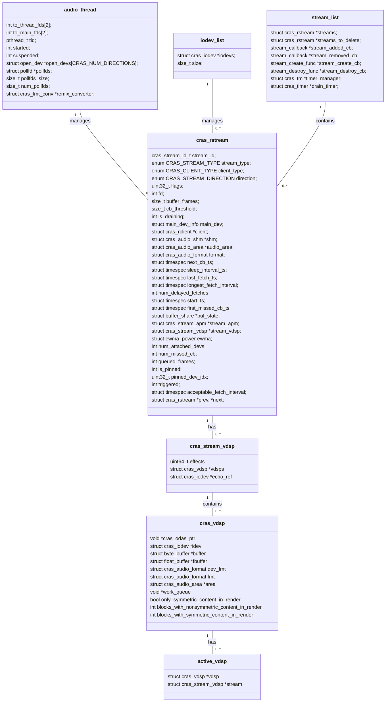

# CRAS Audio Stream and Thread

Tags: Code Study
Created by: Edward Lai
Created time: May 29, 2023 5:36 PM

- Threads: The code uses an audio_thread to manage audio processing tasks. This thread is responsible for handling audio streams and interacting with input/output devices.
- Streams: Audio streams represent the flow of audio data between the application and the audio devices. They are managed by the audio_thread and can be connected to input/output devices.

The function add_stream_to_open_devs is used to add a stream to open devices. It is not directly called within a thread, but it is called by other functions like remove_then_reconnect_stream. These functions might be called in different threads depending on the context of the program.

In summary, threads and streams are related in the sense that the audio_thread manages the audio streams and their connections to input/output devices

## Device Add Stream  Call-Stack

```mermaid

**%%{init: {"flowchart": {"defaultRenderer": "elk"}} }%%**

flowchart LR;
cras_iodev_list_init --enables default input/output device--> enable_device;
cras_iodev_list_init --> audio_thread_start;
%% subgraph createStream [create stream]
restart_dev -->init_and_attach_streams;
EVENT:new-device-connected-->init_device_cb -->init_and_attach_streams;
enable_device-->init_and_attach_streams;
cras_iodev_list_resume_dev-->init_and_attach_streams;

init_and_attach_streams--> add_stream_to_open_devs;

cras_iodev_list_set_aec_ref --> remove_then_reconnect_stream;
cras_iodev_list_reconnect_streams_with_apm --> remove_then_reconnect_stream;
cras_iodev_list_reconnect_streams_with_vdsp --> remove_then_reconnect_stream;

remove_then_reconnect_stream-->add_stream_to_open_devs;
stream_added_cb--> add_stream_to_open_devs;
pinned_stream_added --> add_stream_to_open_devs;

subgraph ide1 [open I/O device]
add_stream_to_open_devs--> cras_stream_apm_add;
add_stream_to_open_devs-->cras_stream_vdsp_add;
end;
```

## Device Remove Stream Call-Stack

```mermaid

**%%{init: {"flowchart": {"defaultRenderer": "elk"}} }%%
flowchart LR**

dev_stream_destroy --> s_f
subgraph s_f[stop flow]
 cras_stream_apm_stop --> cras_stream_vdsp_stop -->cras_rstream_dev_detach;
end;
```

## Add Stream

- initializes new stream instance
- configure stream instance
- append to `stream_list` to list managed

```mermaid

**%%{init: {"flowchart": {"defaultRenderer": "elk"}} }%%
flowchart LR

%% int dev_io_append_stream(struct open_dev **odevs, struct open_dev **idevs,
%%			 struct cras_rstream *stream,
%%			 struct cras_iodev **iodevs, unsigned int num_iodevs)

EVENT:audio_thread_recieved_add_thread --> thread_add_stream;
thread_add_stream-->** dev_io_append_stream;
dev_io_append_stream --> dev_stream_create-->cras_iodev_add_stream;

```

## Reload ini config

- Dynamic Loading ini file

```mermaid

**%%{init: {"flowchart": {"defaultRenderer": "elk"}} }%%
flowchart LR
cras_dsp_reload_ini_by_path --> cmd_reload_ini_by_path;

cmd_reload_ini_by_path --> cras_dsp_ini_create --> iniparser_load_wrapper;
cmd_reload_ini_by_path --> cmd_load_pipeline --> prepare_pipeline;

prepare_pipeline --> lock_and_update["lock mutex stream and update stream with new pipeline\n ctx->pipeline = pipeline;"];**
```

# List of Important Data Structs

## struct `iodev_list`

```cpp
/* Lists for devs[CRAS_STREAM_INPUT] and devs[CRAS_STREAM_OUTPUT]. */
static struct iodev_list devs[CRAS_NUM_DIRECTIONS];
/* Linked list of available devices. */
struct iodev_list {
	struct cras_iodev *iodevs;
	size_t size;
};
```

## struct `audio_thread`

code location: `audio_thread.h`

Thread that handles audio input and output.

```cpp
/* Hold communication pipes and pthread info for the thread used to play or
 * record audio.
 *    to_thread_fds - Send a message from main to running thread.
 *    to_main_fds - Send a synchronous response to main from running thread.
 *    tid - Thread ID of the running playback/capture thread.
 *    started - Non-zero if the thread has started successfully.
 *    suspended - Non-zero if the thread is suspended.
 *    open_devs - Lists of open input and output devices.
 *    pollfds - What FDs wake up this thread.
 *    pollfds_size - Number of available poll fds.
 *    num_pollfds - Number of currently registered poll fds.
 *    remix_converter - Format converter used to remix output channels.
 */
struct audio_thread {
	int to_thread_fds[2];
	int to_main_fds[2];
	pthread_t tid;
	int started;
	int suspended;
	struct open_dev *open_devs[CRAS_NUM_DIRECTIONS];
	struct pollfd *pollfds;
	size_t pollfds_size;
	size_t num_pollfds;
	struct cras_fmt_conv *remix_converter;
};
```

```cpp
enum AUDIO_THREAD_COMMAND {
	AUDIO_THREAD_ADD_OPEN_DEV,
	AUDIO_THREAD_RM_OPEN_DEV,
	AUDIO_THREAD_IS_DEV_OPEN,
	AUDIO_THREAD_ADD_STREAM,
	AUDIO_THREAD_DISCONNECT_STREAM,
	AUDIO_THREAD_STOP,
	AUDIO_THREAD_DUMP_THREAD_INFO,
	AUDIO_THREAD_DRAIN_STREAM,
	AUDIO_THREAD_CONFIG_GLOBAL_REMIX,
	AUDIO_THREAD_DEV_START_RAMP,
	AUDIO_THREAD_REMOVE_CALLBACK,
	AUDIO_THREAD_AEC_DUMP,
};
```

## struct `stream_list` : Single instance of all streams

`stream_list` keep list of `cras_rstream` , registering callbacks of on_add/remove/create

```cpp
/* List of all streams. */
static struct stream_list *stream_list;

struct stream_list {
	struct cras_rstream *streams;
	struct cras_rstream *streams_to_delete;
	stream_callback *stream_added_cb;
	stream_callback *stream_removed_cb;
	stream_create_func *stream_create_cb;
	stream_destroy_func *stream_destroy_cb;
	struct cras_tm *timer_manager;
	struct cras_timer *drain_timer;
};
```

## struct `iodev`: Single instance input or output device

```c
struct cras_iodev {
	void (*set_volume)(struct cras_iodev *iodev);
	void (*set_mute)(struct cras_iodev *iodev);
	void (*set_capture_gain)(struct cras_iodev *iodev);
	void (*set_capture_mute)(struct cras_iodev *iodev);
	int (*set_swap_mode_for_node)(struct cras_iodev *iodev,
				      struct cras_ionode *node, int enable);
	int (*set_display_rotation_for_node)(struct cras_iodev *iodev,
					     struct cras_ionode *node,
					     enum CRAS_SCREEN_ROTATION);
	int (*open_dev)(struct cras_iodev *iodev);
	int (*configure_dev)(struct cras_iodev *iodev);
	int (*close_dev)(struct cras_iodev *iodev);
	int (*update_supported_formats)(struct cras_iodev *iodev);
	int (*frames_queued)(const struct cras_iodev *iodev,
			     struct timespec *tstamp);
	int (*delay_frames)(const struct cras_iodev *iodev);
	int (*get_buffer)(struct cras_iodev *iodev,
			  struct cras_audio_area **area, unsigned *frames);
	int (*put_buffer)(struct cras_iodev *iodev, unsigned nwritten);
	int (*flush_buffer)(struct cras_iodev *iodev);
	int (*start)(const struct cras_iodev *iodev);
	int (*is_free_running)(const struct cras_iodev *iodev);
	int (*output_underrun)(struct cras_iodev *iodev);
	int (*no_stream)(struct cras_iodev *iodev, int enable);
	void (*update_active_node)(struct cras_iodev *iodev, unsigned node_idx,
				   unsigned dev_enabled);
	int (*update_channel_layout)(struct cras_iodev *iodev);
	int (*set_hotword_model)(struct cras_iodev *iodev,
				 const char *model_name);
	char *(*get_hotword_models)(struct cras_iodev *iodev);
	unsigned int (*get_num_severe_underruns)(const struct cras_iodev *iodev);
	int (*get_valid_frames)(struct cras_iodev *odev,
				struct timespec *tstamp);
	unsigned int (*frames_to_play_in_sleep)(struct cras_iodev *iodev,
						unsigned int *hw_level,
						struct timespec *hw_tstamp);
	int (*support_noise_cancellation)(const struct cras_iodev *iodev,
					  unsigned node_idx);
	bool (*set_rtc_proc_enabled)(struct cras_iodev *iodev,
				     enum RTC_PROC_ON_DSP rtc_proc,
				     bool enabled);
	bool (*get_rtc_proc_enabled)(struct cras_iodev *iodev,
				     enum RTC_PROC_ON_DSP rtc_proc);
	struct cras_audio_format *format;
	struct rate_estimator *rate_est;
	struct cras_audio_area *area;
	struct cras_iodev_info info;
	struct cras_ionode *nodes;
	struct cras_ionode *active_node;
	enum CRAS_STREAM_DIRECTION direction;
	size_t *supported_rates;
	size_t *supported_channel_counts;
	snd_pcm_format_t *supported_formats;
	snd_pcm_uframes_t buffer_size;
	unsigned int min_buffer_level;
	**struct cras_dsp_context *dsp_context; // context for dsp.ini context**
	const char *dsp_name;
	struct cras_iodev *echo_reference_dev;
	int is_enabled;
	int software_volume_needed;
	float software_gain_scaler;
	struct dev_stream *streams;
	enum CRAS_IODEV_STATE state;
	unsigned int min_cb_level;
	unsigned int max_cb_level;
	unsigned int highest_hw_level;
	unsigned int largest_cb_level;
	unsigned int num_underruns;
	struct timespec last_reset;
	float num_reset;
	struct buffer_share *buf_state;
	struct timespec idle_timeout;
	struct timespec open_ts;
	struct cras_loopback *loopbacks;
	iodev_hook_t pre_open_iodev_hook;
	iodev_hook_t post_close_iodev_hook;
	struct ext_dsp_module *ext_dsp_module;
	int reset_request_pending;
	struct cras_ramp *ramp;
	int input_streaming;
	unsigned int input_frames_read;
	unsigned int input_dsp_offset;
	unsigned int initial_ramp_request;
	struct input_data *input_data;
	struct ewma_power ewma;
	struct cras_iodev *prev, *next;
};
```

## struct `cras_rstream`: audio stream instance

cras_rstream is used to manage an active audio stream from a client.  Each client can have any number of open streams for playing or recording.

```cpp
/* 
 * Members:
 *    stream_id - identifier for this stream.
 *    stream_type - not used.
 *    client_type - The client type of this stream, like Chrome, ARC++.
 *    **direction - input or output.**
 *    flags - Indicative of what special handling is needed.
 *    fd - Socket for requesting and sending audio buffer events.
 *    buffer_frames - Buffer size in frames.
 *    cb_threshold - Callback client when this much is left.
 *    main_dev_info - The info of the main device this stream attaches to.
 *    is_draining - The stream is draining and waiting to be removed.
 *    **client - The client who uses this stream.**
 *    shm - shared memory
 *    audio_area - space for playback/capture audio
 *    format - format of the stream
 *    next_cb_ts - Next callback time for this stream.
 *    sleep_interval_ts - Time between audio callbacks.
 *    last_fetch_ts - The time of the last stream fetch.
 *    longest_fetch_interval_ts - Longest interval between two fetches.
 *    num_delayed_fetches - Number of fetch_interval >
                            acceptable_fetch_interval.
 *    start_ts - The time when the stream started.
 *    first_missed_cb_ts - The time when the first missed callback happens.
 *    buf_state - State of the buffer from all devices for this stream.
 *    stream_apm - Object holding a handful of audio processing module
 *                 instances.
 *    ewma - The ewma instance to calculate stream volume.
 *    num_attached_devs - Number of iodevs this stream has attached to.
 *    num_missed_cb - Number of callback schedules have been missed.
 *    queued_frames - Cached value of the number of queued frames in shm.
 *    is_pinned - True if the stream is a pinned stream, false otherwise.
 *    pinned_dev_idx - device the stream is pinned, 0 if none.
 *    triggered - True if already notified TRIGGER_ONLY stream, false otherwise.
 *    acceptable_fetch_interval - cb_threshold / sample_rate.
 */
struct cras_rstream {
	cras_stream_id_t stream_id;
	enum CRAS_STREAM_TYPE stream_type;
	enum CRAS_CLIENT_TYPE client_type;
	enum CRAS_STREAM_DIRECTION direction;
	uint32_t flags;
	int fd;
	size_t buffer_frames;
	size_t cb_threshold;
	int is_draining;
	struct main_dev_info main_dev;
	struct cras_rclient *client;
	struct cras_audio_shm *shm;
	struct cras_audio_area *audio_area;
	struct cras_audio_format format;
	struct timespec next_cb_ts;
	struct timespec sleep_interval_ts;
	struct timespec last_fetch_ts;
	struct timespec longest_fetch_interval;
	int num_delayed_fetches;
	struct timespec start_ts;
	struct timespec first_missed_cb_ts;
	struct buffer_share *buf_state;
	struct cras_stream_apm *stream_apm;
#ifdef CRAS_VIBEDSP
	struct cras_stream_vdsp *stream_vdsp;
#endif // CRAS_VIBEDSP
	struct ewma_power ewma;
	int num_attached_devs;
	int num_missed_cb;
	int queued_frames;
	int is_pinned;
	uint32_t pinned_dev_idx;
	int triggered;
	struct timespec acceptable_fetch_interval;
	struct cras_rstream *prev, *next;
};
```

## Audio Stream and Vibe DSP Structs UML

- This class diagram illustrates the UML between audio, stream instance and VDSP module instance



Attempts:

- Tried skipping dsp process `apply_dsp` in/out audio halting still occurs